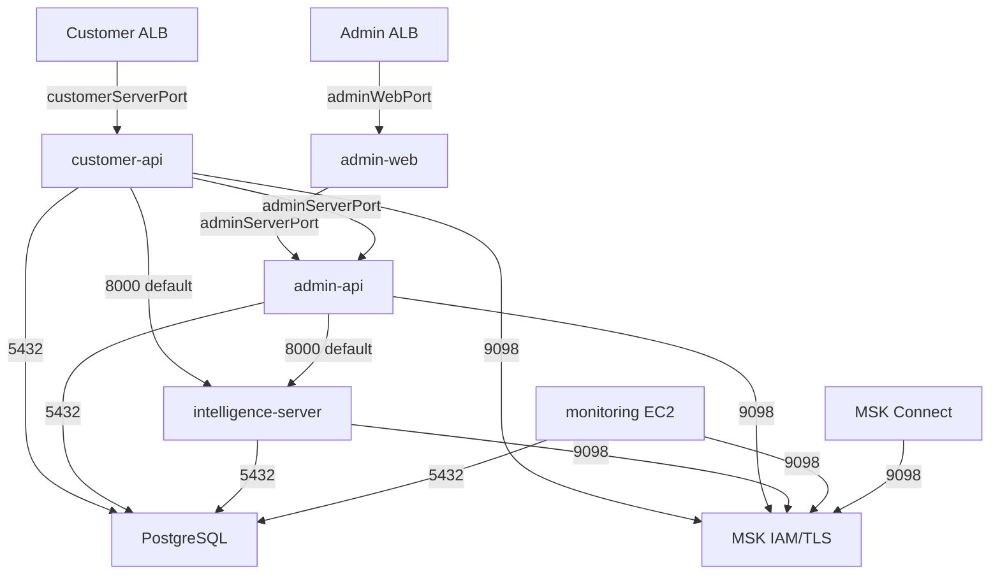

# 1. 개요

이번에 인프라를 구축하면서 가장 먼저 설계와 함께 구축을 구현한 부분이다. 이번 설계의 가장 큰 목표는 `'보안'`이었다.  `Holliverse`는 `고객용 웹앱` / `관리자용 백오피스`가 분리되어 있다. 고객은 고객 페이지에 누구나 접속 가능하지만, 관리자 페이지는 회사 내부나 허용된 특정 IP 대역에서만 접근 가능하도록 만들고 싶었다. 처음에는 이 문제를 `Spring Security` 수준에서 ROLE 기반으로 제어하면 충분하지 않을까 생각했다.

그래서 우선 아래와 같은 고민들로부터 설계를 시작 하였다.

## 고민 1) `Application Load Balancer`를 고객 / 관리자용 2개를 사용해야 되는가?

처음에는 하나의 `ALB` 뒤에 고객 서비스와 관리자 서비스를 함께 두고, 애플리케이션 레벨에서만 권한을 구분하는 방법도 생각했다. 겉보기에도 단순하고, 비용적으로도 최소 2배는 줄일 수 있었다. 하지만 이 경우 `관리자용 엔드포인트` 역시 같은 외부 진입점을 통해 노출된다. 즉, 인증과 인가가 잘 적용되어 있더라도 관리자 페이지로 향하는 경로 자체는 인터넷에 열려 있는 구조가 된다. 이렇게 되면 관리자 시스템의 보안 경계가 네트워크가 아니라 `애플리케이션 코드`에만 의존하게 된다.

물론 `Spring Security`는 강력한 보안 수단이다. 하지만 관리자 기능처럼 민감한 영역은 “로그인하지 않으면 접근할 수 없다” 수준에서 끝낼 것이 아니라, **처음부터 진입 경로 자체를 분리하는 것이 더 안전하다**고 판단했다. 특히 고객 트래픽과 관리자 트래픽은 성격이 완전히 다르다. 고객 서비스는 불특정 다수의 접근을 전제로 하지만, 관리자 서비스는 사용 주체와 접속 위치가 비교적 명확하다.
그렇다면 두 서비스를 같은 진입점에서 처리하기보다, 네트워크 단계부터 분리하는 편이 운영과 보안 모두에서 더 적절하다고 판단했다.

물론 비용은 늘어난다.(시간당  0.0225$, 1달(30일 기준)에 `16.2$`) `ALB`는 시간당 비용이 발생하고, 2개를 사용하면 그만큼 고정비도 증가한다. 하지만 이번 프로젝트에서는 이 비용보다 **관리자 영역을 명확하게 분리해 운영할 수 있다는 점**이 더 중요하다고 판단했다. 보안은 문제가 발생한 뒤에 강화하는 것이 아니라, 처음 구조를 설계할 때부터 반영해야 한다고 생각했기 때문이다.


## 고민 2) 프론트 웹은 Vercel로 배포?

사실 제일 편하게 프론트 웹을 배포하려면 `Vercel`를 이용해서 배포를 진행하면 됐다. `Next.js`와의 조합도 좋고, 배포도 간편하며, 빠르게 서비스 화면을 올리는 데에는 매우 효율적이다. 실제로 고객용 웹처럼 공개 접근이 필요한 서비스라면 충분히 좋은 선택지가 될 수 있다.

하지만 관리자 웹은 성격이 달랐다. 관리자 웹은 누구나 접속할 수 있는 공개 서비스가 아니라, `제한된 사용자`만 접근해야 하는 내부성 서비스에 가까웠다. 따라서 배포 편의성만으로 결정하기에는 보안 요구사항이 더 중요했다.

**관리자 웹 자체가 제한된 경로로만 노출되고, 관리자 서버 역시 그 전제를 바탕으로 보호되는 구조**를 만들고 싶었다. 그런데 관리자 웹을 외부 플랫폼에 올리게 되면, 관리자 프론트와 관리자 백엔드가 같은 보안 경계 안에서 움직인다고 보기 어려워진다.

즉, 프론트는 `외부 SaaS` 위에 있고, 백엔드만 내부 인프라에서 통제하는 반쯤 분리된 구조가 된다. 이 방식도 운영은 가능하겠지만, 내가 처음에 세웠던 `“관리자 영역 전체를 일관된 보안 아래 두겠다”`는 설계 방향과는 조금 달랐다.

그래서 관리자 웹은 Vercel이 아니라 AWS 환경 안에서 함께 운영하기로 했다. 프론트엔드가 `Next.js` 기반이었기 때문에, 정적 파일만 올리는 방식보다는 실행 환경을 함께 제어할 수 있는 배포 방식이 필요했다. 그 결과 관리자 웹도 `ECS`에 올려서 운영하는 방향을 선택했다.

이렇게 하면 관리자 웹과 관리자 서버를 같은 인프라 경계 안에서 관리할 수 있고, ALB, 보안 그룹, 서브넷, 접근 제어 정책 역시 하나의 구조 안에서 일관되게 가져갈 수 있다.

## 2. 전체 네트워크 구조 한 눈에 보기


AWS 네트워크 아키텍처에서 중요한 부분은 `Public Subnet`과 `Private Subnet`의 역할을 완전하게 분리했다는 점이다. Public에는 인터넷과 맞닿는 `ALB`, `WAF`, `NAT Gateway`만 위치시키고, 실제 요청을 처리하는 `ECS 서비스`와 `Data Layer`는 `Private Subnet`에 배치시켰다.

## 3. VPC(Virtual Private Cloud)

VPC는 2개의 가용영역(Availability Zone), Public Subnet, Private Subnet, 그리고 1개의 NAT Gateway로 구성했다.

```java
/*
 * =================================================================
 *                              VPC
 * =================================================================
 */
this.vpc = Vpc.Builder.create(this, "AppVpc")
        .maxAzs(NetworkConstants.MAX_AZ)//가용영역
        .natGateways(NetworkConstants.NAT_GATEWAYS)
        .subnetConfiguration(Arrays.asList(
                SubnetConfiguration
                        .builder()
                        .name(NetworkConstants.SUBNET_PUBLIC)
                        .subnetType(SubnetType.PUBLIC)
                        .cidrMask(NetworkConstants.CIDR_MASK)
                        .build(),
                SubnetConfiguration
                        .builder()
                        .name(NetworkConstants.SUBNET_PRIVATE)
                        .subnetType(SubnetType.PRIVATE_WITH_EGRESS)
                        .cidrMask(NetworkConstants.CIDR_MASK)
                        .build()
        )).build();
```

이 코드는 `NetworkStack`에서 `VPC`를 생성하는 부분이다. `maxAzs=2`이므로 퍼블릭과 프라이빗 서브넷이 각각 2개씩 만들어진다. `퍼블릭 서브넷`은 `ALB`와 `NAT Gateway` 같은 인터넷 접점 리소스를 두는 공간이고, `프라이빗 서브넷`은 `ECS`, `RDS`, `MSK`, `Monitoring EC2`처럼 외부에 직접 드러나면 안 되는 리소스가 들어가는 공간이다.

프라이빗 리소스도 외부 API 호출이나 `CloudWatch` 연동처럼 인터넷으로 나가야 하는 경우가 있기 때문에 `PRIVATE_WITH_EGRESS`를 사용했다. 다만 `NAT Gateway`는 AZ마다 하나씩 두지 않고 1개만 구성했다. 운영 환경에서 비용을 절감하기 위한 선택이었다. 대신 특정 AZ 장애 상황에서는 egress 경로가 하나의 `NAT Gateway`에 의존하게 되는 한계가 있어, 비용과 가용성 사이에서 트레이드오프를 감수한 설계다.

## 4. Security Group 설계

현재 `NetworkStack`은 고객용 ALB, 고객용 API, 관리자용 ALB, 관리자용 웹, 관리자용 API, DB, MSK 브로커, 모니터링, Kafka Connect용 Security Group을 각각 따로 두는 `'최소 권한 규칙'`을 지키고자 하였다. 그리고 대부분의 `Security Group`에 `allowAllOutbound(false)`를 적용해, 아웃바운드도 기본 허용이 아니라 명시 허용 방식으로 가져갈 수 있도록 하였다.

```java
/*
 * =================================================================
 *                         Security Group
 * =================================================================
 */
this.customerAlbSg = SecurityGroup.Builder.create(this, "CustomerAlbSg")
        .vpc(vpc)
        .allowAllOutbound(false)
        .disableInlineRules(true)
        .description("Customer Application Load Balancer Security Group")
        .build();


this.customerApiSg = SecurityGroup.Builder.create(this, "CustomerApiSg")
        .vpc(vpc)
        .allowAllOutbound(false)
        .disableInlineRules(true)
        .description("Customer API Server Security Group")
        .build();
```

해당 설정의 설계는 내부망이니까 열어도 된다라는 식의 느슨한 네트워크 구성을 피했다. 예를 들어 `customer-api`는 HTTPS와 DNS 정도의 외부 아웃바운드만 열고, DB와 MSK는 각 전용 `Security Group`으로만 나갈 수 있다. 즉 `5432`나 `9098`을 인터넷 전체로 열지 않고, 목적지를 `Security Group ID`로 제한했다.

<br/>

```java
/*
 * =================================================================
 *                   Customer Rules
 * =================================================================
 */
customerAlbSg.addEgressRule(
        Peer.securityGroupId(customerApiSg.getSecurityGroupId()),
        Port.tcp(customerServerPort),
        "To Customer API ECS only"
);

customerApiSg.addIngressRule(
        Peer.securityGroupId(customerAlbSg.getSecurityGroupId()),
        Port.tcp(customerServerPort),
        "From customer ALB only"
);

customerApiSg.addEgressRule(
        Peer.securityGroupId(dbSg.getSecurityGroupId()),
        NetworkConstants.POSTGRES,
        "To DB only"
);
```

고객용 API는 오직 고객용 ALB를 통해서만 들어올 수 있게 하였고 `RDS`는 오직 지정된 `API Security Group`에서만 접근 가능하도록 구성하였다.

## 5. 외부 노출 경로의 분리

이 아키텍처에서 인터넷에 직접 노출되는 리소스는 사실상 두 개의 ALB뿐이다. 하나는 고객용 API 앞단의 `Customer ALB`이고, 다른 하나는 관리자 화면 앞단의 `Admin ALB`다. 둘 다 퍼블릭 서브넷에 배치되지만, 접근 정책은 완전히 다르게 가져갔다.

```java
this.customerAlb = ApplicationLoadBalancer.Builder.create(this, CUSTOMER_ALB)
        .vpc(loadBalancerProps.vpc())
        .internetFacing(true)
        .securityGroup(loadBalancerProps.customerAlbSg())
        .deletionProtection(true)
        .vpcSubnets(publicSubnets)
        .build();
```

고객용 ALB는 공개 API 진입점이므로 인터넷 전체에서 `80`, `443` 접근을 받는다. 다만 `80` 포트는 HTTPS 리다이렉트 전용이고, 실제 요청 처리는 `443` 리스너에서 이뤄진다.  ALB 뒤의 `customer-api`는 여전히 프라이빗 서브넷에 있고, `customerAlbSg`에서 오는 트래픽만 받는다.

```java
allowedIpList.forEach(ip -> {
    adminAlbSg.addIngressRule(Peer.ipv4(ip), NetworkConstants.HTTP, "Admin HTTP from allowed IP");
    adminAlbSg.addIngressRule(Peer.ipv4(ip), NetworkConstants.HTTPS, "Admin HTTPS from allowed IP");
});
```

관리자 외부 경로는 고객 외부 경로보다 한 단계 더 강하게 닫아 두었다.

```java
allowedIpList.forEach(ip -> {
    adminAlbSg.addIngressRule(Peer.ipv4(ip), NetworkConstants.HTTP, "Admin HTTP from allowed IP");
    adminAlbSg.addIngressRule(Peer.ipv4(ip), NetworkConstants.HTTPS, "Admin HTTPS from allowed IP");
});
```

`ADMIN_ALLOWED_CIDRS` 환경 변수에 들어 있는 허용 IP 대역만 관리자 ALB에 접근할 수 있게 만들었다. 즉 `admin` 경로는 단순히 별도 서브도메인일 뿐 아니라, `네트워크 레벨`에서도 제한된 진입점이다.

관리자 경로가 `Admin ALB -> admin-web -> admin-api`처럼 두 단계로 나누어 관리자는 브라우저로 `admin-web`에 먼저 도착하고, 이후 내부 프록시나 API 호출을 통해 `admin-api`와 연결된다. 즉 관리자 API는 인터넷 사용자가 직접 때리는 구조가 아니라, 관리자 웹과 내부 서비스가 중심이 되는 구조다.

## 6. 서비스 간 통신은 "필요 조합"만 Open



처음부터 서비스끼리 서로 자유롭게 통신하게 두고 싶지는 않았다. 같은 VPC 안에 있다고 해서 전부 열어 두면 나중에 구조가 복잡해질수록 어디서 어디로 붙는지 파악하기가 어려워진다고 생각했다. 그래서 실제로 필요한 통신만 하나씩 정리해서 열어 두는 방식으로 구성했다.

예를 들어 `customer-api`는 단순히 사용자 요청만 처리하는 서버가 아니었다. DB에도 붙어야 하고, MSK와도 통신해야 했고, 상황에 따라 `admin-api`나 `intelligence-server`도 호출해야 했다. `admin-api`도 마찬가지였다. 관리자 요청만 받는 서버가 아니라 `DB`, `MSK`, `intelligence` 서비스까지 함께 연결되는 구조였다. 나는 그래서 네트워크 문서에서도 단순히 계층만 나누기보다, 어떤 서비스가 어떤 대상을 호출하는지를 드러내는 쪽이 더 중요하다고 봤다.

## 7. ECS 서비스

ECS 서비스들을 구현한 `EcsClusterStack`를 보면 각 어플리케이션의 런타임이 어떤 네트워크를 가져가는 지 작성되어 이싿.

```java
SubnetSelection privateSubnets = SubnetSelection.builder()
        .subnetType(SubnetType.PRIVATE_WITH_EGRESS)
        .build();

PrivateDnsNamespace serviceNs = PrivateDnsNamespace.Builder.create(this, DOMAIN_NAME_SPACE)
        .vpc(vpc)
        .name(AppConfig.getInternalDomainName())
        .build();
```

모든 ECS 서비스는 `PRIVATE_WITH_EGRESS` 서브넷에 배치했다. 그리고 `Cloud Map` 기반의 `private DNS namespace`를 별도로 생성했다. 이 구조로 아래의 두 가지를 의도했다. 

1. ECS 태스크는 퍼블릭 IP 없이 동작하므로 인터넷에서 직접 접근할 수 없다.
2. 내부 서비스끼리는 고정 IP 대신 서비스 이름으로 서로를 찾을 수 있다.

```java
FargateService.Builder serviceBuilder = FargateService.Builder.create(this, SERVICE_ID)
        .cluster(props.cluster())
        .taskDefinition(taskDefinition)
        .securityGroups(List.of(props.serviceSg()))
        .vpcSubnets(props.subnets())
        .assignPublicIp(false)
        .desiredCount(props.desiredCount())
        .enableExecuteCommand(props.enableEcsExec());
```

`assignPublicIp(false)`가 들어가 있기 때문에 ECS 서비스는 외부에서 직접 붙을 수 없다. 결국 외부 사용자가 애플리케이션에 접근하는 유일한 공식 경로는 ALB다.

Cloud Map을 사용하여 `admin-web`은 내부적으로 `admin-api.internal-domain:port` 형태의 주소를 사용하고, `customer-api`와 `admin-api`는 다시 `intelligence-server.internal-domain:port`를 호출한다. 이 방식을 사용하여 내부 서비스의 IP가 바뀌어도 호출 코드를 바꿀 필요가 없고, 배포 중 태스크 교체가 일어나도 네트워크 구성이 훨씬 유연해진다.

## 8. Data Layer

이 구성에서 `RDS(PostgreSQL)`는 철저하게 프라이빗으로 두었다.

```java
// RDS 인스턴스 생성
this.rds = DatabaseInstance.Builder.create(this, "HolliversePostgres")
        .engine(postgresEngine)
        .vpc(vpc)
        .vpcSubnets(dbSubnets)
        .securityGroups(List.of(dbSg))
        .iamAuthentication(true)
        .databaseName(DB_NAME)
        .port(DB_PORT)
        .multiAz(false)
        .publiclyAccessible(false)
        .deletionProtection(true)
        .build();
```

`publiclyAccessible(false)`가 핵심이다. DB는 인터넷에 직접 노출되지 않으며, 접근은 `dbSg`에 허용된 Security Group만 가능하다. 현재 코드 기준으로는 `customer-api`, `admin-api`, `intelligence-server`, `monitoring`이 DB에 접근할 수 있다. 

`AWS MSK`를 사용하는 Kafka 계층도 동일한 방식을 적용했다.

```java
this.cluster = new CfnCluster(this, "ProvisionedCluster",
        CfnClusterProps.builder()
                .brokerNodeGroupInfo(CfnCluster.BrokerNodeGroupInfoProperty.builder()
                        .clientSubnets(privateSubnetIds)
                        .securityGroups(List.of(kafkaBrokerSg.getSecurityGroupId()))
                        .build())
                .clientAuthentication(CfnCluster.ClientAuthenticationProperty.builder()
                        .sasl(CfnCluster.SaslProperty.builder()
                                .iam(CfnCluster.IamProperty.builder()
                                        .enabled(true)
                                        .build())
                                .build())
                        .build())
                .encryptionInfo(CfnCluster.EncryptionInfoProperty.builder()
                        .encryptionInTransit(CfnCluster.EncryptionInTransitProperty.builder()
                                .clientBroker("TLS")
                                .inCluster(true)
                                .build())
                        .build())
                .build());
```

`MSK 브로커` 역시 `private subnet`에 놓았고, 인증은 IAM 기반 SASL, 전송 구간은 TLS를 사용했다. 그리고 네트워크 레벨에서는 `9098` 포트를 아무 데나 열지 않고, `customer-api`, `admin-api`, `intelligence-server`, `monitoring`, `kafka-connect` 같은 허용된 클라이언트 SG에서만 접근 가능하게 했다.
